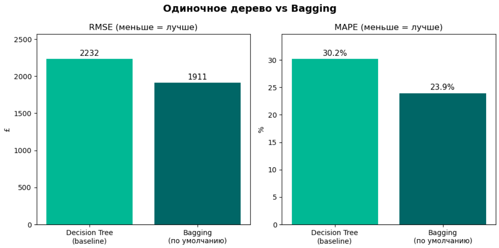
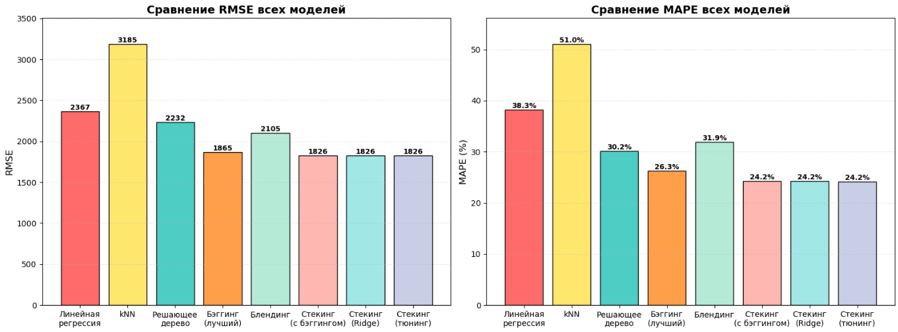

# Прогнозирование цен подержанных автомобилей (UK)

Построение и сравнение ансамблевых методов (Bagging, Blending, Stacking) для оценки стоимости подержанных автомобилей. Полный ML-пайплайн: от EDA и предобработки до подбора гиперпараметров и интерпретации результатов.

## Бизнес-задача

Автоматизировать оценку подержанных автомобилей на основе реальных данных, чтобы снизить зависимость от субъективных мнений продавцов и повысить доверие покупателей к платформе. Для этого обучены и сравнены ансамблевые методы, из них выбран лучший по соотношению точность/сложность.

## Данные

Датасет [Used Cars Prices in UK](https://www.kaggle.com/datasets/muhammadawaistayyab/used-cars-prices-in-uk) - 3 685 объявлений с autotrader.co.uk, 13 признаков.

## Что сделано

- EDA: распределения цены, статистика важных признаков, корреляционный анализ
- Предобработка: заполнение пропусков, One-Hot Encoding категориальных признаков, объединение редких классов
- Baseline: одиночное решающее дерево
- Bagging: `BaggingRegressor` + подбор гиперпараметров (`GridSearchCV`)
- Blending: 3 базовые модели (LinearRegression, kNN, DecisionTree) + мета-модель
- Stacking: `StackingRegressor` с кросс-валидацией, сравнение мета-моделей (Linear, Ridge, RandomForest), тюнинг kNN и Ridge
- Сравнение всех моделей по RMSE и MAPE

#### Одиночное дерево vs Bagging

#### Сравнение всех моделей

## Результат

Наилучшие результаты показали 3 модели: Стекинг (с бэггингом), Стекинг (Ridge), Стекинг (тюнинг). Разница между вариантами в пределах 0.1% - они эквивалентны.

## Стек

`Python` `pandas` `NumPy` `scikit-learn` `Matplotlib` `GridSearchCV` `BaggingRegressor` `StackingRegressor`

## Структура

- `car_price_prediction.ipynb` — ноутбук с кодом и выводами
- `used_cars_UK.csv` — датасет (скачать по выше и поместить в папку с ноутбуком)
